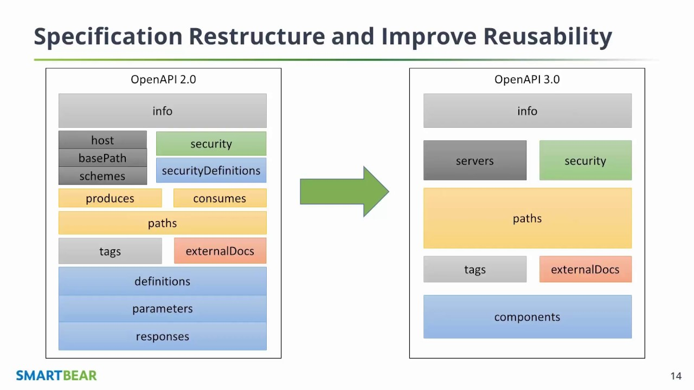

# Open API.

## Contents at a Glance.
* [About](#about)
* [Documentation.](#documentation)
* [Pros.](#pros)
* [Cons.](#cons)
* [Help](#help)

## About.

## Documentation.

## Open API Description.
* OpenAPI - short for OpenAPI Specification
  * Often abbreviated as OA3 - for OpenAPI 3.x
* OpenAPI is a widely adopted standard for describing APIs
* Strong Industry Support for OpenAPI
  * Backers include - Microsoft, Google, and IBM
* OpenAPI is considered technology agnostic
  * Thus, developers using Java, .NET, PHP, Ruby, etc - can all benefit from OpenAPI
* OpenAPI Specifications are defined in YAML or JSON
* The OpenAPI Specification is backed by a formal schema
  * This defines the document’s properties and data types
* Because the OpenAPI is a structured document it can be read programmatically
* OpenAPI Tools - Converters, Validators, GUI Editors, Mock Services, SDK Generators, Documentation
* OpenAPI CodeGen - Generate Server code for 20+ different languages; Client code for 40+ languages

## Single Source of Truth
* The OpenAPI Specification becomes the single source of truth for what the API is supposed to do.
* Without OpenAPI - what defines the API?
  * Source code?
  * Design documentation on wiki?
  * Unit tests?
  * Email messages between developers?

## OpenAPI at Velo Payments
* Microservices define API via OpenAPI Specification
* Unit Tests use OpenAPI to validate all requests and responses
* Test are run locally and during CI/CD
* Consumer Driven Contracts defined in OpenAPI extensions
* Client Side SDKs published in ~8 languages using OpenAPI generated code
* Public documentation generated from OpenAPI specification

## Pros.

## Cons.

## Help.
